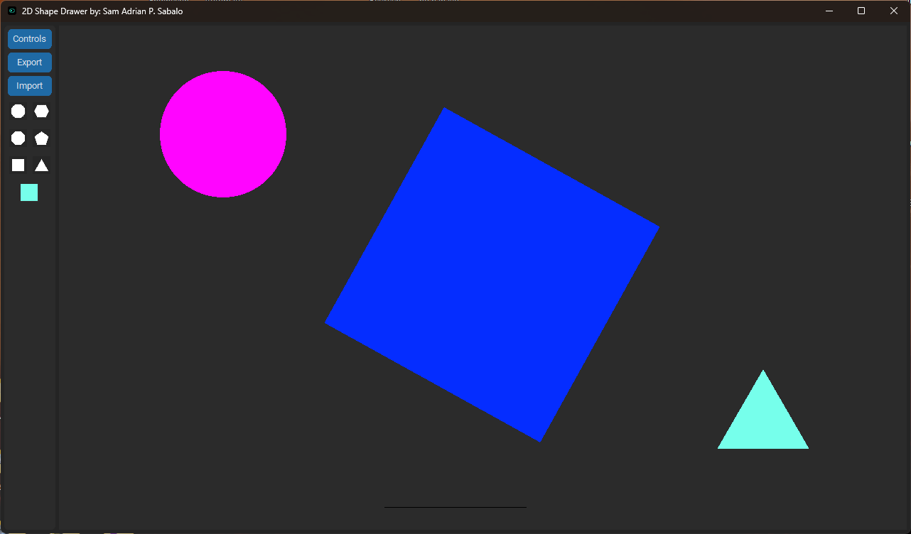
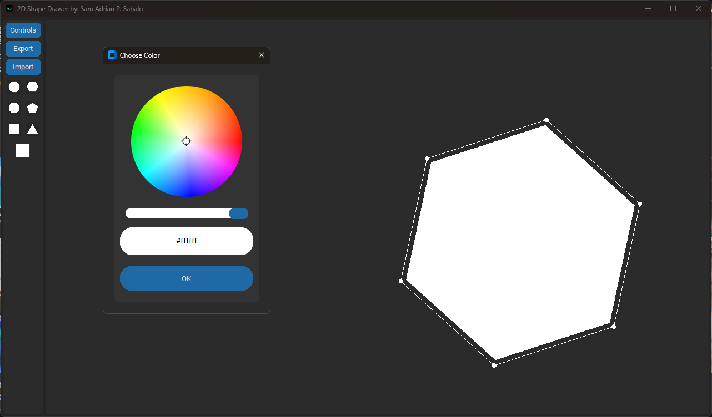

# OpenGL 2D Playground

Welcome to the **OpenGL 2D Playground** — a beginner-friendly tool built with Python and OpenGL that lets users draw, manipulate, and manage 2D shapes in a GUI environment. This project was created as a way to practice OpenGL fundamentals and GUI programming with `CustomTkinter`.

## 🧠 About This Project

This app serves as a simple canvas for learning and experimenting with 2D shape rendering. It features basic transformation tools (resize, rotate, move), color customization, and file export/import for saving your work. Whether you're a student learning OpenGL or a hobbyist prototyping visuals, this template provides a smooth foundation.

## 🛠 Prerequisites

* Python 3.10 or later recommended
* (Optional) Set up a virtual environment:

  ```bash
  python -m venv venv
  source venv/bin/activate  # or venv\Scripts\activate on Windows
  ```

## 🔧 Installation

1. Clone this repository:

   ```bash
   git clone https://github.com/yourusername/2D-Shape-Drawer.git
   cd 2D-Shape-Drawer
   ```

2. Install required libraries:

   ```bash
   pip install -r requirements.txt
   ```

## 🚀 Running the App

Start the app by running:

```bash
python app.py
```

Once launched, the application window will appear with a drawable canvas and interactive GUI controls.

## ✨ Features

* 🟠 Add basic 2D shapes (rectangles, ellipses, etc.)
* 🔄 Rotate, move, resize (uniform) shapes
* 🎨 Customize shape colors using an advanced color picker
* 🗑 Delete selected shapes
* 💾 Import and export your shape designs
* ⌨️ Keyboard shortcuts for quick access

## 🌱 Future Improvements

* Resize shapes along X or Y independently
* Add more customizable and complex shape types
* Enable shape manipulation using mouse interaction
* Implement undo/redo functionality
* Add snapping and alignment tools
* Extend import/export support to more formats (e.g., JSON, SVG)

## 🖼 UI Previews


*Main Drawing Interface*


*Color Picker in Action*

## 🙏 Acknowledgements

* [CTkColorPicker](https://github.com/Akascape/CTkColorPicker) — Enhanced color picking UI
* [pyopengltk](https://github.com/jonwright/pyopengltk) — Bridging OpenGL rendering with Tkinter

## 📝 License

This project is licensed under the **GNU General Public License v3.0**.
See the [LICENSE](LICENSE) file for full details.

> You are free to use, modify, and share this software. Any derivative works must also be licensed under the GPL-3.0.

## 🧠 Project Purpose

This project was developed as part of **OpenGL programming practice** and serves as a stepping stone for building more advanced 2D or 3D rendering tools in Python using `CustomTkinter`.
